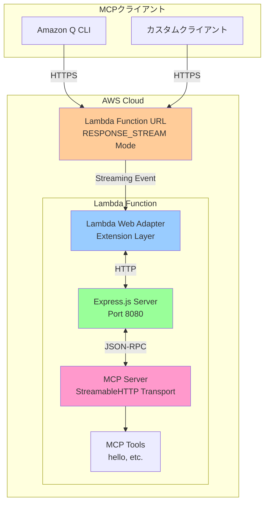
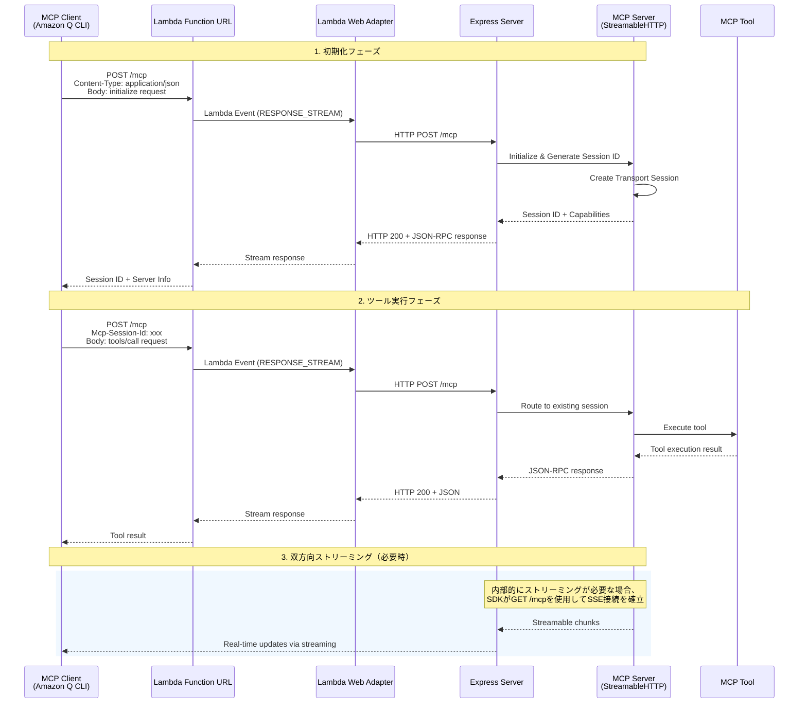

# AWS MCP Playground

AWS Lambda上でRemote MCPサーバーを構築・運用するためのプロジェクトです。Lambda Function URL + Lambda Web Adapterを使用して、ストリーミング対応のMCPサーバーをサーバーレス環境で実現します。

## 目次

- [Remote MCPとは](#remote-mcpとは)
- [なぜAWSでRemote MCPを構築するのか](#なぜawsでremote-mcpを構築するのか)
- [アーキテクチャ](#アーキテクチャ)
- [プロジェクト構成](#プロジェクト構成)
- [セットアップ手順](#セットアップ手順)
- [ローカル開発](#ローカル開発)
- [AWSへのデプロイ](#awsへのデプロイ)
- [MCPクライアントとの接続](#mcpクライアントとの接続)
- [トラブルシューティング](#トラブルシューティング)

## Remote MCPとは

**MCP (Model Context Protocol)** は、AIアシスタント（Claude、ChatGPTなど）が外部のツールやデータソースと連携するための標準プロトコルです。

**Remote MCP** は、MCPサーバーをクラウド上でホスティングし、HTTPSを介してMCPクライアント（AI）と通信する構成です。

### Remote MCPのメリット

1. **セキュリティ**: ツールの実行環境をクラウドに隔離
2. **スケーラビリティ**: サーバーレスで自動スケーリング
3. **複数クライアント対応**: 1つのサーバーを複数のAIアシスタントから利用可能
4. **運用管理の簡素化**: ローカル環境の設定不要

## なぜAWSでRemote MCPを構築するのか

### AWS Lambda + Function URLの利点

| 特徴 | 説明 |
|------|------|
| **サーバーレス** | インフラ管理不要、自動スケーリング |
| **低コスト** | 実行時間課金、API Gateway不要 |
| **ストリーミング対応** | RESPONSE_STREAMモードでStreamable HTTP完全サポート |
| **高可用性** | AWS標準のSLA（99.95%）|
| **簡単なデプロイ** | AWS CDKでInfrastructure as Code |

### 技術スタック

- **AWS Lambda**: Node.js 22.x（Docker Image）
- **Lambda Function URL**: HTTPS エンドポイント（RESPONSE_STREAM モード）
- **Lambda Web Adapter**: HTTPサーバー⇔Lambdaの変換レイヤー
- **Express.js**: Webフレームワーク
- **MCP SDK**: Model Context Protocol実装（Streamable HTTP）
- **AWS CDK**: インフラ定義（TypeScript）

## アーキテクチャ

### システム全体構成図



### Lambda Function URLの役割

```
┌─────────────────────────────────────────────────────────────┐
│ Lambda Function URL (RESPONSE_STREAM Mode)                  │
├─────────────────────────────────────────────────────────────┤
│ ✅ HTTPSエンドポイント提供                                    │
│ ✅ ストリーミングレスポンス対応（最大200MB）                    │
│ ✅ CORS設定                                                  │
│ ✅ 最大15分実行時間                                           │
│ ✅ API Gateway不要（コスト削減）                              │
└─────────────────────────────────────────────────────────────┘
```

### Lambda Web Adapterの役割

```
┌─────────────────────────────────────────────────────────────┐
│ Lambda Web Adapter                                          │
├─────────────────────────────────────────────────────────────┤
│ Lambda Event → HTTP Request への変換                        │
│ HTTP Response → Lambda Response への変換                    │
│ ストリーミングレスポンスの中継                                  │
│ 既存のExpressアプリをそのまま動作可能                          │
└─────────────────────────────────────────────────────────────┘
```

### Streamable HTTPについて

**Streamable HTTP**は、MCP仕様（2025年3月版）で採用された新しいトランスポート方式です。旧SSE方式から移行し、以下の利点があります：

- ✅ **単一エンドポイント（POST /mcp）で双方向通信**
- ✅ **ステートレスな通信が可能**
- ✅ **自動セッション復旧機能**
- ✅ **必要に応じた内部ストリーミング**
- ✅ **既存Webインフラとの高い互換性**

> **注意:** GET /mcp と DELETE /mcp エンドポイントも実装されていますが、これらはMCP SDKの内部実装または後方互換性のためのものです。主要な通信はPOST /mcpで行われます。

### リクエストフロー

#### POST /mcp（初期化 & ツール実行）

Streamable HTTPでは、すべての通信がPOSTエンドポイントを通じて行われます。



### AWSリソース構成

```
┌──────────────────────────────────────────────────┐
│ AWS Account / Region (e.g., ap-northeast-1)     │
├──────────────────────────────────────────────────┤
│                                                  │
│  ┌────────────────────────────────────────┐     │
│  │ Lambda Function                        │     │
│  │ AwsMcpPlayground-McpServer-v2          │     │
│  ├────────────────────────────────────────┤     │
│  │ Runtime: Docker Image                  │     │
│  │ Memory: 512 MB                         │     │
│  │ Timeout: 30 seconds                    │     │
│  │ Environment:                           │     │
│  │   NODE_ENV: production                 │     │
│  │   PORT: 8080                           │     │
│  │   AWS_LWA_INVOKE_MODE: RESPONSE_STREAM │     │
│  └────────────────────────────────────────┘     │
│         │                                        │
│         │ Function URL (Auth: NONE)             │
│         ↓                                        │
│  https://xxxxx.lambda-url.region.on.aws/        │
│         │                                        │
│         ├─ GET  /health                          │
│         ├─ POST /mcp                             │
│         ├─ GET  /mcp                             │
│         └─ DELETE /mcp                           │
│                                                  │
│  ┌────────────────────────────────────────┐     │
│  │ CloudWatch Logs                        │     │
│  │ /aws/lambda/AwsMcpPlayground-McpServer │     │
│  │ Retention: 7 days                      │     │
│  └────────────────────────────────────────┘     │
│                                                  │
│  ┌────────────────────────────────────────┐     │
│  │ IAM Role                               │     │
│  │ Lambda Execution Role                  │     │
│  │ - CloudWatch Logs Write                │     │
│  └────────────────────────────────────────┘     │
└──────────────────────────────────────────────────┘
```

## プロジェクト構成

```
aws-mcp-playground/
├── bin/                          # CDKアプリのエントリーポイント
│   └── aws-mcp-playground.ts
├── lib/                          # CDKスタック定義
│   └── aws-mcp-playground-stack.ts
├── src/                          # MCPサーバーのソースコード
│   ├── app.ts                    # Expressアプリ設定
│   ├── index.ts                  # ローカル開発用サーバー
│   ├── lambda.ts                 # Lambdaハンドラー
│   └── tools/                    # MCPツール
├── test/                         # CDK単体テスト
│   └── aws-mcp-playground.test.ts
├── cdk.json                      # CDK設定
└── package.json                  # 依存関係とスクリプト
```

## セットアップ手順

### 前提条件

以下のツールがインストールされている必要があります：

- **Node.js** 22.x以上
- **pnpm** 10.x以上
- **Docker** (ローカルテスト用、オプション)
- **AWS CLI** (デプロイ用)
- **AWS CDK** 2.x以上 (デプロイ用)

### 依存関係のインストール

```bash
pnpm install
```

### ビルド

TypeScriptをJavaScriptにコンパイルします：

```bash
pnpm run build
```

ビルド成果物は `dist/` ディレクトリに出力されます。

## ローカル開発

### 通常の開発サーバー

開発サーバーを起動します（ホットリロード対応）：

```bash
pnpm run dev
# サーバーが http://localhost:3000 で起動
```

### Dockerでのローカルテスト

本番環境と同じDocker環境でローカルテストを実行できます。

#### 1. ビルド前の準備

Dockerビルド前に、必ずTypeScriptをコンパイルしてください：

```bash
pnpm run build
```

#### 2. Dockerイメージをビルド

```bash
docker build -t mcp-server-local .
```

#### 3. コンテナを起動

```bash
docker run -d -p 8080:8080 --name mcp-server-local mcp-server-local
```

#### 4. ヘルスチェック

```bash
curl http://localhost:8080/health
```

期待されるレスポンス:
```json
{
  "status": "ok",
  "timestamp": "2025-01-01T12:00:00.000Z"
}
```

#### 5. MCP初期化テスト

```bash
curl -X POST http://localhost:8080/mcp \
  -H "Content-Type: application/json" \
  -d '{
    "jsonrpc": "2.0",
    "id": 1,
    "method": "initialize",
    "params": {
      "protocolVersion": "2024-11-05",
      "capabilities": {},
      "clientInfo": {
        "name": "test-client",
        "version": "1.0.0"
      }
    }
  }'
```

#### 6. Tools一覧の取得

セッションIDを環境変数に保存してから、ツール一覧を取得します：

```bash
# 上記のinitializeレスポンスからセッションIDを取得
export SESSION_ID="取得したセッションID"

curl -X POST http://localhost:8080/mcp \
  -H "Content-Type: application/json" \
  -H "Mcp-Session-Id: $SESSION_ID" \
  -d '{
    "jsonrpc": "2.0",
    "id": 2,
    "method": "tools/list",
    "params": {}
  }'
```

#### 7. コンテナの停止と削除

```bash
# コンテナを停止
docker stop mcp-server-local

# コンテナを削除
docker rm mcp-server-local

# または一括で
docker stop mcp-server-local && docker rm mcp-server-local
```

### その他の便利なコマンド

```bash
# CloudFormationテンプレートを生成
pnpm run cdk:synth

# 現在のデプロイとの差分を表示
pnpm run cdk:diff

# CDK単体テストを実行
pnpm test

# TypeScriptの変更を監視して自動コンパイル
pnpm run watch
```

## AWSへのデプロイ

### デプロイ前の準備

#### 1. AWS CLIの設定

AWS CLIがインストールされ、認証情報が設定されている必要があります：

```bash
aws configure
```

または、AWS CLIプロファイルを使用する場合：

```bash
export AWS_PROFILE=your-profile-name
```

#### 2. CDKブートストラップ（初回のみ）

AWSアカウントとリージョンでCDKを初めて使用する場合は、ブートストラップが必要です：

```bash
pnpm run cdk:bootstrap
```

プロファイルを指定する場合：

```bash
pnpm run cdk:bootstrap --profile your-profile-name
```

### デプロイの実行

#### 1. ビルド

TypeScriptをコンパイルします：

```bash
pnpm run build
```

#### 2. デプロイ前の差分確認（推奨）

```bash
pnpm run cdk:diff
```

#### 3. デプロイ実行

```bash
pnpm run cdk:deploy
```

プロファイルを指定する場合：

```bash
pnpm run cdk:deploy --profile your-profile-name
```

デプロイが完了すると、以下のような出力が表示されます：

```
✅  AwsMcpPlaygroundStack

Outputs:
AwsMcpPlaygroundStack.FunctionUrl = https://abc123def456.lambda-url.ap-northeast-1.on.aws/
AwsMcpPlaygroundStack.McpEndpoint = https://abc123def456.lambda-url.ap-northeast-1.on.aws/mcp
AwsMcpPlaygroundStack.LambdaFunctionArn = arn:aws:lambda:ap-northeast-1:123456789012:function:AwsMcpPlayground-McpServer-v2

Stack ARN:
arn:aws:cloudformation:ap-northeast-1:123456789012:stack/AwsMcpPlaygroundStack/...
```

### デプロイ後の動作確認

デプロイが成功したら、MCPサーバーが正常に動作しているか確認します。

#### 1. ヘルスチェック

```bash
# 環境変数にFunction URLを設定
export FUNCTION_URL="https://abc123def456.lambda-url.ap-northeast-1.on.aws"

# ヘルスチェック
curl ${FUNCTION_URL}/health
```

期待されるレスポンス:
```json
{
  "status": "ok",
  "timestamp": "2025-01-01T12:00:00.000Z"
}
```

#### 2. MCP初期化テスト

```bash
curl -X POST ${FUNCTION_URL}/mcp \
  -H "Content-Type: application/json" \
  -d '{
    "jsonrpc": "2.0",
    "id": 1,
    "method": "initialize",
    "params": {
      "protocolVersion": "2024-11-05",
      "capabilities": {},
      "clientInfo": {
        "name": "test-client",
        "version": "1.0.0"
      }
    }
  }'
```

#### 3. Tools一覧の取得

```bash
# initializeレスポンスからセッションIDを取得して設定
export SESSION_ID="取得したセッションID"

curl -X POST ${FUNCTION_URL}/mcp \
  -H "Content-Type: application/json" \
  -H "Mcp-Session-Id: $SESSION_ID" \
  -d '{
    "jsonrpc": "2.0",
    "id": 2,
    "method": "tools/list",
    "params": {}
  }'
```

### デプロイのロールバック

デプロイに問題があった場合、以前のバージョンに戻すことができます：

```bash
# CloudFormationコンソールからロールバック、または
aws cloudformation rollback-stack --stack-name AwsMcpPlaygroundStack
```

### リソースの削除

AWSリソースを削除する場合：

```bash
pnpm run cdk:destroy
```

プロファイルを指定する場合：

```bash
pnpm run cdk:destroy --profile your-profile-name
```

## MCPクライアントとの接続

### Amazon Q CLIでの設定

Amazon Q CLIは、Streamable HTTPトランスポートを使用してMCPサーバーに接続できます。

```json
{
  "mcpServers": {
    "aws-mcp-playground": {
      "type": "http",
      "url": "https://abc123def456.lambda-url.ap-northeast-1.on.aws/mcp",
      "timeout": 5000
    }
  }
}
```

**重要:** `url`の値を、デプロイ時に出力された実際のLambda Function URL + `/mcp`に置き換えてください。

## トラブルシューティング

### デプロイ関連

#### Docker Image のビルドに失敗する

**症状:** `cdk deploy`時にDockerイメージのビルドエラーが発生

**解決策:**
1. `pnpm run build`を実行して`dist/`ディレクトリが存在することを確認
2. Dockerが起動していることを確認
3. ローカルで`docker build -t test .`を実行してエラーを特定

#### CDK Bootstrap エラー

**症状:** `cdk deploy`で「This stack requires bootstrapping」エラー

**解決策:**
```bash
pnpm run cdk:bootstrap
```

#### Lambda関数のタイムアウト

**症状:** Lambda実行時に30秒でタイムアウトする

**解決策:**
`lib/aws-mcp-playground-stack.ts`でタイムアウト時間を延長:
```typescript
timeout: cdk.Duration.seconds(300), // 5分に延長
```

### MCP接続関連

#### Claude Desktopでツールが表示されない

**症状:** Claude Desktopを再起動してもツールアイコンが表示されない

**解決策:**
1. 設定ファイルのパスが正しいか確認
2. JSON形式が正しいか確認（カンマ、括弧など）
3. Claude Desktopのログを確認:
   - macOS: `~/Library/Logs/Claude/`
   - Windows: `%APPDATA%\Claude\logs\`
4. `MCP_FETCH_BASE_URL`が正しいFunction URLか確認

#### セッションIDエラー

**症状:** `Bad Request: No valid session ID provided`エラー

**解決策:**
1. 最初に必ず`initialize`リクエストを実行
2. レスポンスからセッションIDを取得
3. 以降のリクエストで`Mcp-Session-Id`ヘッダーを含める

### AWS関連

### よくある質問

#### Q: Function URLのURLを忘れた場合は？

**A:** CDKスタックの出力を再確認:
```bash
aws cloudformation describe-stacks \
  --stack-name AwsMcpPlaygroundStack \
  --query 'Stacks[0].Outputs'
```

## 参考リンク

- [Model Context Protocol (MCP) 公式ドキュメント](https://modelcontextprotocol.io/)
- [AWS Lambda Web Adapter](https://github.com/awslabs/aws-lambda-web-adapter)
- [AWS CDK 公式ドキュメント](https://docs.aws.amazon.com/cdk/)
- [Lambda Function URLs](https://docs.aws.amazon.com/lambda/latest/dg/lambda-urls.html)
- [Lambda Response Streaming](https://docs.aws.amazon.com/lambda/latest/dg/configuration-response-streaming.html)