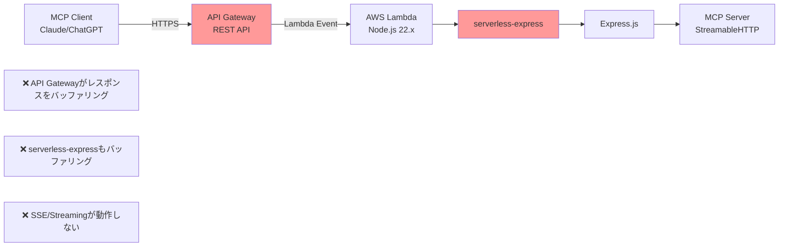
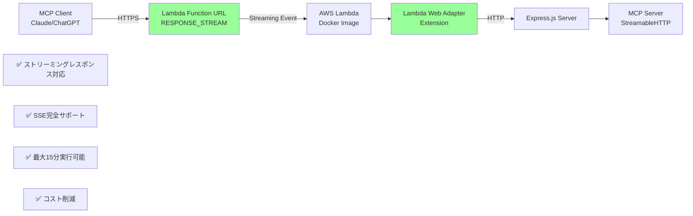
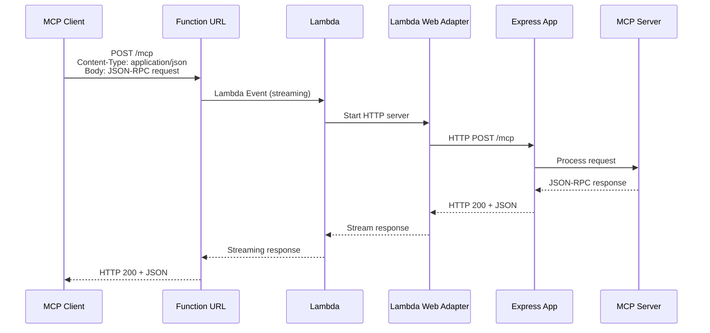
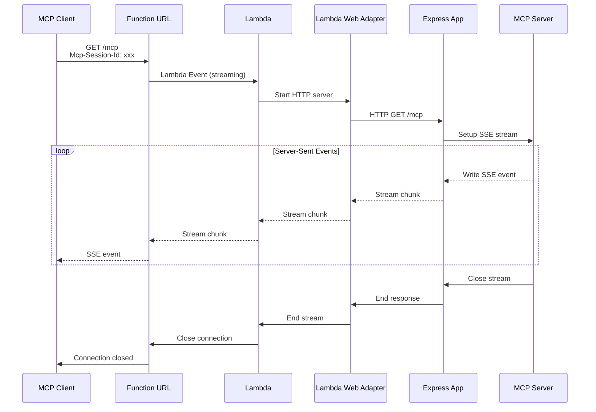

# AWS MCP Playground

AWS Lambda + API GatewayでRemote MCPサーバーを動作させるプロジェクトです。AWS CDKを使用してTypeScriptでインフラを構築しています。

## アーキテクチャ

### 現在の構成（API Gateway版）



**問題点:**
- API Gatewayが全レスポンスをバッファリング（30秒タイムアウト）
- serverless-expressがHTTPレスポンスをバッファリング
- Streamable HTTPとSSEが正常に動作しない

### 推奨構成（Lambda Function URL + Lambda Web Adapter版）



**メリット:**
- ストリーミングレスポンス完全対応（最大200MB）
- SSE（Server-Sent Events）サポート
- 最大15分の実行時間（API Gatewayは30秒）
- コスト削減（API Gateway料金が不要）
- コード変更最小限（Expressをほぼそのまま使用）

### データフロー詳細

#### POST /mcp（リクエスト・レスポンス）


#### GET /mcp（SSEストリーム）


### 技術スタック

- **AWS Lambda**: Node.js 22.x（Docker Image）
- **Lambda Function URL**: HTTPS エンドポイント（RESPONSE_STREAM モード）
- **Lambda Web Adapter**: HTTPサーバー⇔Lambdaの変換レイヤー
- **Express.js**: Webフレームワーク
- **MCP SDK**: Model Context Protocol実装（Streamable HTTP）
- **AWS CDK**: インフラ定義（TypeScript）

## プロジェクト構成

```
aws-mcp-playground/
├── bin/                          # CDKアプリのエントリーポイント
│   └── aws-mcp-playground.ts
├── lib/                          # CDKスタック定義
│   └── aws-mcp-playground-stack.ts
├── src/                          # MCPサーバーのソースコード
│   ├── app.ts                    # Expressアプリ設定
│   ├── index.ts                  # ローカル開発用サーバー
│   ├── lambda.ts                 # Lambdaハンドラー
│   └── tools/                    # MCPツール
├── test/                         # CDK単体テスト
│   └── aws-mcp-playground.test.ts
├── cdk.json                      # CDK設定
└── package.json                  # 依存関係とスクリプト
```

## 開発環境

### 依存関係のインストール

```bash
pnpm install
```

### ビルド

```bash
pnpm run build
```

### ローカル開発

#### 通常の開発サーバー

```bash
pnpm run dev
# サーバーが http://localhost:3000 で起動
```

#### Dockerでのローカルテスト

本番環境と同じDocker環境でローカルテストを実行できます。

**1. Dockerイメージをビルド**
```bash
docker build -t mcp-server-test .
```

**2. コンテナを起動**
```bash
docker run -d -p 8080:8080 --name mcp-server-test mcp-server-test
```

**3. ヘルスチェック**
```bash
curl http://localhost:8080/health
```

期待されるレスポンス:
```json
{
  "status": "ok",
  "timestamp": "2025-01-01T12:00:00.000Z",
  "server": {
    "name": "aws-mcp-playground",
    "version": "0.0.1",
    "environment": "production"
  },
  "mcp": {
    "connected": true,
    "sessionType": "stateless"
  }
}
```

**4. MCP初期化テスト**
```bash
curl -X POST http://localhost:8080/mcp \
  -H "Content-Type: application/json" \
  -H "Accept: application/json, text/event-stream" \
  -d '{
    "jsonrpc": "2.0",
    "id": 1,
    "method": "initialize",
    "params": {
      "protocolVersion": "2024-11-05",
      "capabilities": {},
      "clientInfo": {
        "name": "test-client",
        "version": "1.0.0"
      }
    }
  }'
```

期待されるレスポンス（SSE形式）:
```
event: message
data: {"result":{"protocolVersion":"2024-11-05","capabilities":{"tools":{"listChanged":true}},"serverInfo":{"name":"aws-mcp-playground","version":"0.0.1"}},"jsonrpc":"2.0","id":1}
```

**5. Tools APIテスト**
```bash
curl -X POST http://localhost:8080/mcp \
  -H "Content-Type: application/json" \
  -H "Accept: application/json, text/event-stream" \
  -d '{
    "jsonrpc": "2.0",
    "id": 2,
    "method": "tools/list",
    "params": {}
  }'
```

**6. コンテナの停止**
```bash
# コンテナ名で停止
docker stop mcp-server-test

# または、実行中のコンテナIDを確認して停止
docker ps  # コンテナIDを確認
docker stop <CONTAINER_ID>
```

**7. コンテナの削除**
```bash
docker rm mcp-server-test
```

**8. コンテナの確認**
```bash
# 実行中のコンテナを表示
docker ps

# 全てのコンテナを表示（停止中も含む）
docker ps -a
```

### CDKコマンド

```bash
# CloudFormationテンプレートを生成
pnpm run cdk:synth

# 現在のデプロイとの差分を表示
pnpm run cdk:diff

# AWSにデプロイ
pnpm run cdk:deploy

# AWSリソースを削除
pnpm run cdk:destroy
```

### テスト

```bash
# CDK単体テストを実行
pnpm test

# 監視モード
pnpm run watch
```

## デプロイ手順

1. **AWS CLIの設定**:
   ```bash
   aws configure
   ```

2. **CDKブートストラップ（初回のみ）**:
   ```bash
   pnpm run cdk:bootstrap
   ```

3. **ビルド＆デプロイ**:
   ```bash
   pnpm run cdk:deploy
   ```

   デプロイが完了すると、以下のような出力が表示されます：
   ```
   Outputs:
   AwsMcpPlaygroundStack.FunctionUrl = https://abc123def456.lambda-url.ap-northeast-1.on.aws/
   AwsMcpPlaygroundStack.McpEndpoint = https://abc123def456.lambda-url.ap-northeast-1.on.aws/mcp
   AwsMcpPlaygroundStack.LambdaFunctionArn = arn:aws:lambda:ap-northeast-1:123456789012:function:AwsMcpPlayground-McpServer
   ```

4. **デプロイ後の動作確認**:

   **4-1. ヘルスチェック**
   ```bash
   FUNCTION_URL="https://abc123def456.lambda-url.ap-northeast-1.on.aws"
   curl ${FUNCTION_URL}/health
   ```

   **4-2. MCP初期化テスト**
   ```bash
   curl -X POST ${FUNCTION_URL}/mcp \
     -H "Content-Type: application/json" \
     -H "Accept: application/json, text/event-stream" \
     -d '{
       "jsonrpc": "2.0",
       "id": 1,
       "method": "initialize",
       "params": {
         "protocolVersion": "2024-11-05",
         "capabilities": {},
         "clientInfo": {
           "name": "test-client",
           "version": "1.0.0"
         }
       }
     }'
   ```

   **4-3. Tools APIテスト**
   ```bash
   curl -X POST ${FUNCTION_URL}/mcp \
     -H "Content-Type: application/json" \
     -H "Accept: application/json, text/event-stream" \
     -d '{
       "jsonrpc": "2.0",
       "id": 2,
       "method": "tools/list",
       "params": {}
     }'
   ```

## MCP統合

Claude DesktopでデプロイしたMCPサーバーを使用する設定:

```json
{
  "mcpServers": {
    "aws-mcp-server": {
      "command": "npx",
      "args": ["-y", "@modelcontextprotocol/server-fetch"],
      "env": {
        "MCP_FETCH_BASE_URL": "https://abc123def456.lambda-url.ap-northeast-1.on.aws"
      }
    }
  }
}
```

**注意:** `YOUR_API_URL`を実際のLambda Function URLに置き換えてください（デプロイ時に`FunctionUrl`として出力されます）。

## 便利なコマンド

- `pnpm run build`          TypeScriptをJavaScriptにコンパイル
- `pnpm run watch`          変更を監視して自動コンパイル
- `pnpm test`               Jest単体テストを実行
- `pnpm run cdk:deploy`     スタックをデフォルトのAWSアカウント/リージョンにデプロイ
- `pnpm run cdk:diff`       デプロイ済みスタックと現在の状態を比較
- `pnpm run cdk:synth`      CloudFormationテンプレートを生成
